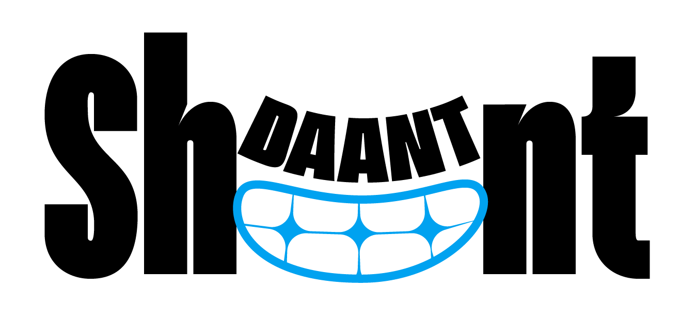
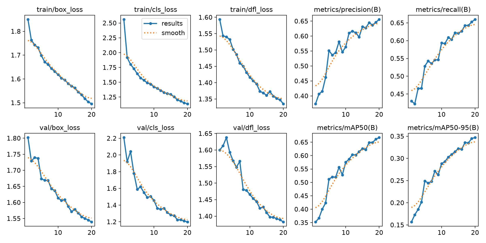
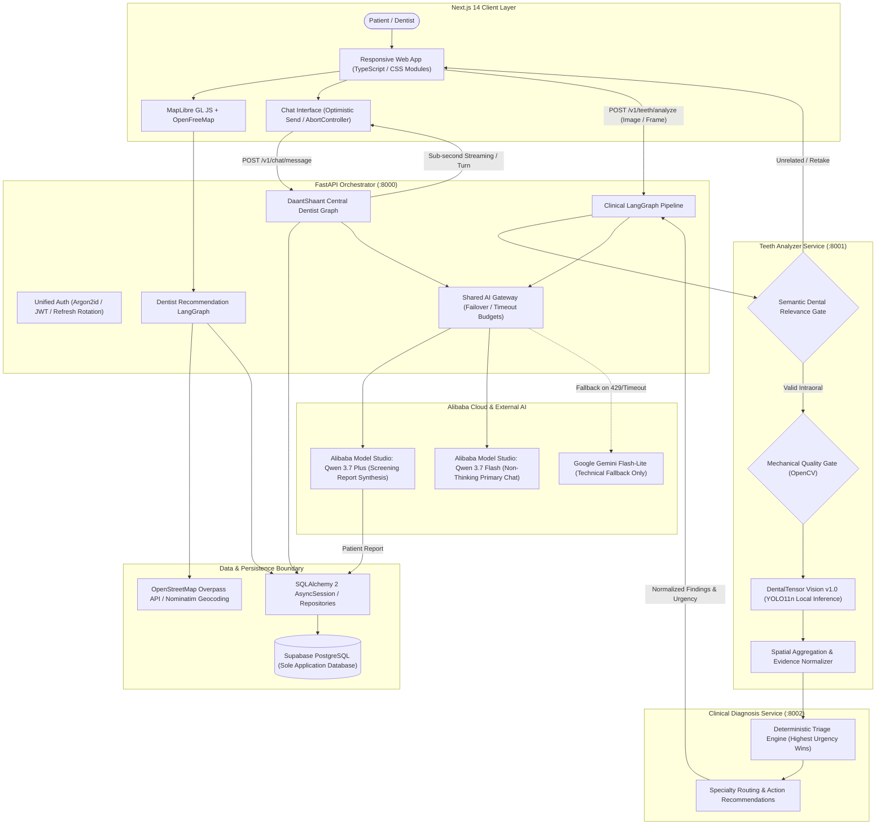
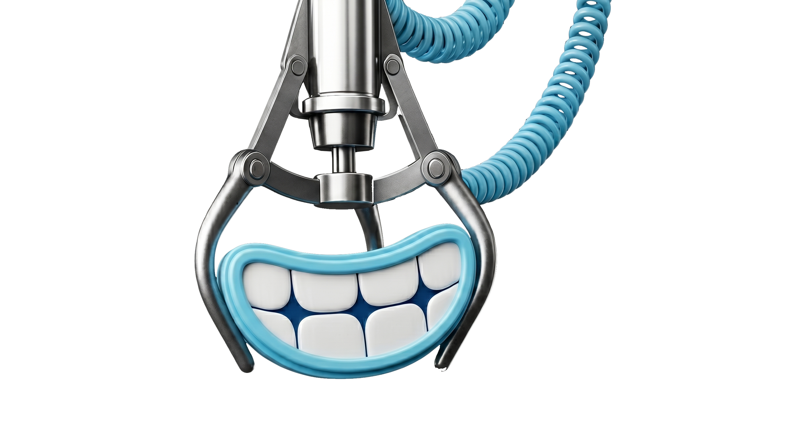
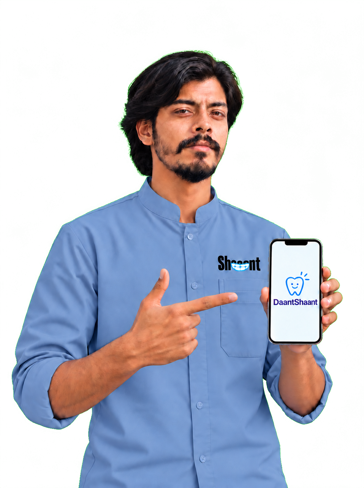
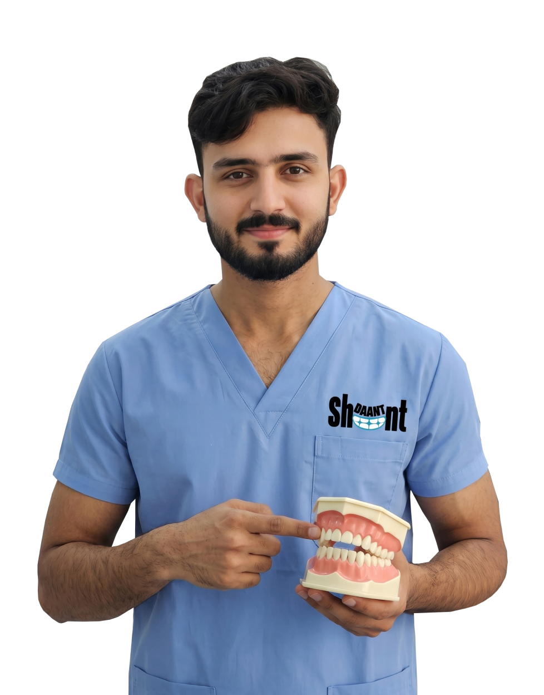
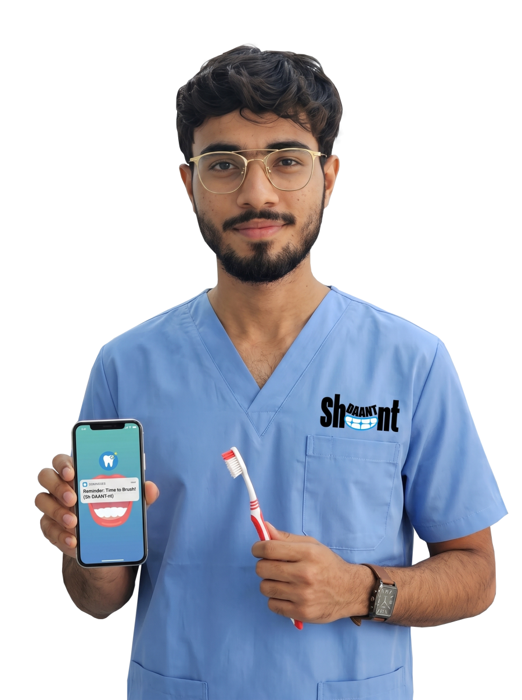

<p align="center">
  
</p>

# DaantShaant

<p align="center">
  <strong>An AI-powered dental screening, clinical triage, patient guidance, and care-navigation platform.</strong>
</p>

<p align="center">
  
  
  
  
  
  
  
  
  
  
</p>

---

## Purpose & Impact

DaantShaant was conceived and developed for the **Alibaba Cloud Bano Qabil Hackathon 2026** to bridge the deep divide between initial oral health awareness and professional clinical dental care across Pakistan and the UAE.

| Dimension | Implementation Details |
| :--- | :--- |
| **The problem you are solving, and who it affects** | Millions of individuals face significant barriers to preliminary dental evaluation—driven by prohibitive clinical costs, severe dental anxiety, low oral-health literacy, and geographic disparities. Patients frequently cannot distinguish harmless surface tooth staining from destructive occlusal decay or recognize early gingivitis before it advances to irreversible periodontitis, leading to delayed interventions and costly emergency extractions. |
| **Your solution, and the audience it serves** | An end-to-end, multi-tier oral health platform serving individuals, families, and certified dental practices. Patients capture or upload intraoral photos for immediate semantic relevance gating, computer-vision detection via **DentalTensor Vision v1.0**, deterministic clinical triage, personalized bilingual guidance in English and Urdu, and open-map discovery of verified local dental providers. |
| **The need it addresses and the impact it makes** | Solves clinical ambiguity and care hesitation. By converting subjective dental fears into structured, visual observations and actionable urgency categories (*Routine*, *Soon*, *Urgent*, *Emergency*), DaantShaant empowers individuals to seek the right level of care at the right time while maintaining a persistent longitudinal dental history. |
| **The innovation and the technology behind it** | **Decoupled Perception & Reasoning Pipeline**: Unlike naive approaches that send raw intraoral photos directly to general-purpose LLMs, DaantShaant pairs a fine-tuned, local edge-capable oral pathology detector (**DentalTensor Vision v1.0**, YOLO11n fine-tuned on cloud GPUs) with **Deterministic Triage Rules** and **Alibaba Model Studio Qwen** (`qwen3.7-flash` & `qwen3.7-plus`) orchestrating grounded structured reports and sub-second chat navigation via **LangGraph**. |
| **Feasibility, and what you have actually built** | A complete, functional hackathon prototype consisting of a responsive Next.js 14 web client, three specialized FastAPI backend microservices, a unified async SQLAlchemy 2 persistence layer on Supabase PostgreSQL, an offline evaluation harness, and an interactive OpenStreetMap/MapLibre clinic locator—fully implemented, container-ready, and verified with hundreds of automated tests. |

---

## Key Product Capabilities

<table>
  <tr>
    <td width="50%">
      <h3>🔍 AI Dental Screening</h3>
      <p>Supports Snapshot, Image Upload, and Live WebSocket scanning. Incoming intraoral imagery is first verified by a Semantic Relevance Gate before running through mechanical quality checks and local computer-vision inference.</p>
    </td>
    <td width="50%">
      <h3>🦷 DentalTensor Vision v1.0</h3>
      <p>Custom intraoral object-detection model fine-tuned on audited clinical datasets to detect calculus/tartar, caries/cavity suspects, gingivitis, discoloration, and oral ulcers without sending raw patient imagery to third-party APIs.</p>
    </td>
  </tr>
  <tr>
    <td width="50%">
      <h3>⚖️ Deterministic Clinical Triage</h3>
      <p>Zero LLM hallucination in clinical classification. A deterministic rule engine classifies findings into clear urgency tiers (<code>routine</code> &lt; <code>soon</code> &lt; <code>urgent</code> &lt; <code>emergency</code>) and matches the patient with the appropriate dental specialty.</p>
    </td>
    <td width="50%">
      <h3>💬 DaantShaant Central Dentist</h3>
      <p>An intelligent, sub-second conversational assistant orchestrating structured SQL RAG, deterministic NLP (<50ms), and Qwen 3.7 Flash text generation to answer questions about screening results, appointments, and oral hygiene.</p>
    </td>
  </tr>
  <tr>
    <td width="50%">
      <h3>📊 Patient & Dentist Dashboards</h3>
      <p>Authentic, data-driven aggregate dashboards. Patients track longitudinal screening history, active appointments, and personalized product recommendations. Dentists manage clinic profiles, verified listings, and consultation requests.</p>
    </td>
    <td width="50%">
      <h3>🗺️ Open Dentist Discovery</h3>
      <p>Privacy-preserving clinic discovery powered by OpenStreetMap Overpass API, OpenFreeMap vector tiles, and MapLibre GL JS. Deterministically ranks clinics by specialty relevance and verified platform partner status without proprietary mapping fees.</p>
    </td>
  </tr>
  <tr>
    <td width="50%">
      <h3>🌐 Bilingual (EN / UR) & Theming</h3>
      <p>Comprehensive English and Urdu localization with 100% dictionary key parity (190+ keys), automatic RTL/LTR layout shifting, Urdu typography fallbacks, and contrast-optimized Light and Dark modes.</p>
    </td>
    <td width="50%">
      <h3>🔐 Enterprise Auth & Data Resilience</h3>
      <p>Unified user identity on Supabase PostgreSQL utilizing Argon2id password hashing, in-memory short-lived access JWTs, rotating HttpOnly refresh cookies, and automatic reconnection retry buffers.</p>
    </td>
  </tr>
</table>

---

## DentalTensor Vision v1.0

**DentalTensor Vision v1.0** is an independent, custom computer-vision model engineered and fine-tuned by **Nathan Asif** during the development of DaantShaant.

Conceived to solve the latency, privacy, and cost bottlenecks of sending raw biometric imagery to cloud LLMs, DentalTensor handles low-level intraoral perception locally with high efficiency.

<p align="center">
  
  &nbsp;&nbsp;
  
</p>

### Model Specifications
- **Developer / Author**: **Nathan Asif**
- **Base Architecture**: Ultralytics YOLO11n (Nano Object Detection Network)
- **Model Size**: 101 layers, 2,583,127 parameters, 6.4 GFLOPs (at 640×640)
- **Training Infrastructure**: Modal Serverless Cloud GPU (NVIDIA A10G 24GB VRAM), AdamW optimizer, 12 epochs transfer learning from baseline
- **Production Weights**: `services/teeth_analyzer/models/oral_disease/dentaltensor_nathan_asif_v1.pt`

### Supported Visual Condition Classes & Calibrated Thresholds
DentalTensor Vision evaluates 5 distinct oral condition categories with engineering thresholds chosen to balance sensitivity against false-positive suppression:

| Model Class Name | Normalized Clinical Code | Calibrated Cutoff | Clinical Screening Target |
| :--- | :--- | :---: | :--- |
| `calculus` | `tartar` | **`0.35`** | Supragingival and marginal dental calculus / tartar accumulation |
| `caries` | `cavity_suspect` | **`0.55`** | Visible enamel cavitation, structural breakdown, and decay lesions |
| `gingivitis` | `gingivitis_signs` | **`0.50`** | Marginal gingival erythema, swelling, and inflammatory signs |
| `tooth discoloration` | `discoloration` | **`0.65`** | Chromatic variation, intrinsic/extrinsic staining (isolated from decay) |
| `ulcer` | `oral_ulcer` | **`0.65`** | Mucosal aphthous ulcers, sores, and soft-tissue disruptions |

### Clinical Perception vs. LLM Reasoning Separation
To ensure maximum clinical safety, DaantShaant strictly decouples visual perception from text reasoning:
1. **DentalTensor Vision**: Operates purely as a localized visual evidence extractor, returning bounding boxes, class labels, spatial distribution, and confidence scores.
2. **Deterministic Triage**: Applies strict clinical logic to aggregate findings and determine urgency.
3. **Alibaba Qwen LLM**: Receives **structured text evidence only** (never raw images) to synthesize compassionate, patient-friendly explanations.
> [!NOTE]
> DentalTensor Vision is an engineering screening tool and does not provide a definitive medical diagnosis. Findings are designed to navigate patients toward timely clinical validation.

---

## Architecture

DaantShaant operates as a coordinated multi-service ecosystem driven by LangGraph state machines and FastAPI microservices.



---

## Tech Stack

| Layer | Technologies | Purpose & Details |
| :--- | :--- | :--- |
| **Frontend** | **Next.js 14**, React 18, TypeScript 5.4 | Server-side rendering, App Router, responsive portal interfaces |
| | **CSS Modules & Pure CSS** | Zero-bloat, custom styling, high-contrast dark/light mode token system |
| | **MapLibre GL JS**, OpenFreeMap | Open-source vector tile map rendering using Liberty style |
| **Backend** | **FastAPI 0.115**, Uvicorn | High-performance asynchronous API services and WebSocket handlers |
| | **Python 3.11+**, Pydantic v2 | Strict type validation, settings management, and structured schemas |
| | **httpx** | Async HTTP client for inter-service communication and Model Studio calls |
| **AI / Machine Learning** | **DentalTensor Vision v1.0** | Custom fine-tuned Ultralytics YOLO11n oral pathology perception model |
| | **Alibaba Model Studio (Qwen)** | `qwen3.7-flash` (primary chat assistant) and `qwen3.7-plus` (clinical report) |
| | **LangGraph**, LangChain Core | Deterministic clinical screening, dentist ranking, and recommendation stategraphs |
| | **OpenCV**, Pillow, NumPy | Image preprocessing, contrast enhancement, and Laplacian blur gating |
| | **Google Gemini** | `gemini-flash-lite-latest` as secondary technical fallback |
| **Database & Persistence**| **Supabase PostgreSQL** | Sole persistent application database for patient data, scans, and chats |
| | **SQLAlchemy 2 Async**, asyncpg | Provider-neutral asynchronous ORM and repository layer |
| | **Alembic** | Automated database schema migrations |
| **Authentication** | **Argon2id (argon2-cffi)**, PyJWT | Industry-standard password hashing and short-lived in-memory JWTs |
| | HttpOnly Rotating Cookies | Secure SHA-256 session token rotation with cross-tab lock synchronization |
| **Mapping & Geocoding** | **OpenStreetMap Overpass API** | Live query of regional dental clinics (`amenity=dentist`, `healthcare=dentist`) |
| | **OSM Nominatim** | Privacy-first reverse geocoding and address autocomplete for PK and UAE |
| **DevOps & Tooling** | **uv** (Astral), Pytest | Lightning-fast Python package management and testing harness |
| | **Modal Serverless GPU** | Cloud GPU infrastructure for offline model training and fine-tuning |
| | **Apache2**, PM2, Systemd | Production reverse proxy and backend process supervision |

---

## AI Model Architecture & Latency Calibration

```text
Intraoral Photo Capture
         │
         ▼
┌───────────────────────────────────────────────┐
│         DentalTensor Vision v1.0              │
│       Ultralytics YOLO11n (2.58M params)      │
│  Calculus (0.35) │ Caries (0.55)              │
│  Gingivitis (0.50) │ Discoloration (0.65)     │
│  Ulcer (0.65)                                 │
└───────────────────────┬───────────────────────┘
                        │ Normalized Visual Findings (No raw images sent upstream)
                        ▼
┌───────────────────────────────────────────────┐
│          Clinical Report Generator            │
│          Alibaba Model Studio:                │
│             qwen3.7-plus                      │
│   Structured patient-friendly narrative       │
│   Guarded non-diagnostic terminology          │
└───────────────────────────────────────────────┘

Conversational Dental Queries
         │
         ▼
┌───────────────────────────────────────────────┐
│         DaantShaant Central Dentist           │
│         LangGraph + Structured RAG            │
│         Alibaba Model Studio:                 │
│      qwen3.7-flash (Thinking Disabled)        │
│   Empirical Benchmark: ~789ms latency         │
│   Technical Fallback: gemini-flash-lite       │
└───────────────────────────────────────────────┘
```

- **Perception Isolation**: Raw biometric images are processed locally by DentalTensor Vision; cloud LLMs receive only anonymized, structured evidence tags.
- **Chat Benchmark Optimization**: In empirical multi-model testing across 18 clinical scenarios, `qwen3.7-flash` (thinking disabled) achieved a 100% success rate with an average latency of **~789ms**, outperforming models with extended reasoning loops for real-time interaction.
- **Global Deadline Enforcement**: Hard budgets in Orchestrator prevent socket stalls: 2.0s DB retrieval, 12.0s Qwen generation, 15.0s hard request timeout with safe graceful degradation.

---

## Visual Interface & Demo Walkthrough

### 1. Landing & Patient Portal
The clean, bilingual landing page guides users directly into self-screening, patient registration, and dentist portal access.
<p align="center">
  
</p>

### 2. Dental Scan Experience
Patients choose between Snapshot, File Upload, or Real-time WebSocket video scanning. A multi-stage progress tracker reassures the patient while Semantic Relevance gating filters non-dental inputs.

```text
[ Camera Frame / Upload ]
        ↓
[ 1. Preparing Image ] ──────▶ [ 2. Checking Dental Relevance ]
                                            ↓
[ 4. Deterministic Triage ] ◀── [ 3. DentalTensor Vision Inference ]
        ↓
[ 5. Synthesizing Patient Report ]
```

### 3. AI Screening & Triage Report
Findings are presented in human-first language with explicit urgency badges and specialist recommendations:

```text
┌────────────────────────────────────────────────────────────────────────┐
│  AI SCREENING VERDICT: Possible localized dental concerns detected     │
│  URGENCY LEVEL: [ Soon — Professional Dental Checkup Recommended ]     │
├────────────────────────────────────────────────────────────────────────┤
│  OBSERVED EVIDENCE:                                                    │
│  • Possible Enamel Cavitation / Decay lesion (OC-02 occlusal)           │
│  • Visible Supragingival Calculus deposits (Lower lingual anterior)     │
│                                                                        │
│  RECOMMENDED SPECIALIST: General Dentist / Restorative Specialist      │
│  TIMEFRAME: Schedule consultation within 1 to 2 weeks                  │
│                                                                        │
│  DISCLAIMER: DaantShaant provides AI-assisted screening, not a         │
│  definitive medical diagnosis. Professional confirmation required.    │
└────────────────────────────────────────────────────────────────────────┘
```

### 4. DaantShaant Conversational Assistant
Patients interact directly with the **DaantShaant** assistant to discuss their scan results, ask oral hygiene questions, or request care navigation:

```text
Patient: "Why did the scan flag tooth decay near my molar?"
DaantShaant: "The screening detected visual features consistent with possible
enamel cavitation on your lower molar. While this does not confirm a deep
cavity, scheduling a routine checkup will allow a dentist to probe the area
and prevent further structural breakdown."
```

### 5. Interactive Dentist Discovery
Patients view local dental clinics mapped via MapLibre GL JS and OpenFreeMap, with clear visual distinctions between verified platform partners (with consultation booking) and external OpenStreetMap practices.

---

## Project Structure

```text
DaantShaant/
├── apps/
│   └── web/                           # Next.js 14 Web Application
│       ├── app/                       # App Router (portal, scan, chat, dentists)
│       ├── components/                # React UI Components & MapLibre Viewer
│       ├── i18n/                      # Bilingual Dictionaries (en.ts, ur.ts)
│       └── public/landing/            # Brand Logos, Mascots & Team Assets
├── orchestrator/                      # Central FastAPI Gateway (:8000)
│   ├── src/orchestrator/
│   │   ├── ai/                        # Shared Provider-Neutral AI Gateway
│   │   ├── central_dentist/           # LangGraph Central Dentist & Structured RAG
│   │   ├── clinical/                  # Clinical LangGraph & Relevance Pipeline
│   │   ├── db/                        # SQLAlchemy 2 Async Engine & Session
│   │   ├── dentist_portal/            # Dentist Registration, Auth & Operations
│   │   ├── dentist_recommendation/    # OSM Overpass Integration & Ranking
│   │   └── repositories/              # Relational Repositories (PostgreSQL)
│   └── tests/                         # Comprehensive Pytest Test Suites
├── services/
│   ├── teeth_analyzer/                # Vision Inference Service (:8001)
│   │   ├── models/oral_disease/       # DentalTensor Vision Model Checkpoints
│   │   └── src/teeth_analyzer/        # OpenCV Preprocessing & YOLO Detector
│   └── diagnosis/                     # Clinical Classification Service (:8002)
│       └── src/diagnosis/             # Deterministic Triage Rules & Urgency Logic
├── packages/
│   └── dantshaant_common/             # Shared Pydantic Schemas & Domain Enums
├── scripts/                           # Tooling, Dataset Preparation & Diagnostics
├── docs/                              # Architecture, Model Cards & Phase Logs
│   ├── dentaltensor-model-card.md     # Official DentalTensor Model Card
│   └── third-party-usage.md           # Third-Party Dependency Inventory
├── start-backends.bat                 # Windows All-in-One Service Launcher
├── start-backends.ps1                 # PowerShell Async Backend Manager
└── .env.example                       # Documented Configuration Template
```

---

## Local Development Setup

### Prerequisites
- **Python 3.11+**
- **Node.js 18+** & `npm`
- **uv** (recommended for ultra-fast Python virtualenvs)
- **Supabase PostgreSQL** instance (or local PostgreSQL)

### 1. Clone & Configure Environment
```bash
git clone https://github.com/Develosphere/DaantShaant.git
cd DaantShaant

# Copy the example environment template
cp .env.example .env
```
*Edit `.env` to provide your `DATABASE_URL`, `JWT_SECRET`, and API keys (`DASHSCOPE_API_KEY` for Alibaba Model Studio Qwen, `GEMINI_API_KEY` for fallback).*

### 2. Python Backend Setup
```powershell
# Create and activate virtual environment
cd orchestrator
uv venv
.\.venv\Scripts\Activate.ps1

# Install orchestrator, services, and common packages
uv pip install -e . -e ..\services\teeth_analyzer -e ..\services\diagnosis -e ..\packages\dantshaant_common

# Run database migrations
python -m alembic upgrade head
cd ..
```

### 3. Launch Backend Services (Windows)
Run the automated launcher to start all three backend microservices on ports 8000, 8001, and 8002:
```powershell
.\start-backends.bat
```
*(Or use `powershell -File .\start-backends.ps1`)*

### 4. Launch Frontend Web App
```bash
cd apps/web
npm install
npm run dev
```
Open [http://localhost:3000](http://localhost:3000) in your browser.

---

## Production Deployment Architecture

DaantShaant is structured for reliable multi-tier deployment:

```text
[ Client Traffic: HTTPS ]
         │
         ▼
[ Cloudflare / DNS ]
         │
         ▼
[ Production Host (Ubuntu VPS) ]
  ├── Apache2 (SSL Termination & Reverse Proxy)
  │     ├── /             ──▶ Next.js (PM2 Node.js cluster :3000)
  │     ├── /api/         ──▶ FastAPI Orchestrator (Uvicorn :8000)
  │     ├── /teeth/       ──▶ Teeth Analyzer Service (Uvicorn :8001)
  │     └── /diagnosis/   ──▶ Diagnosis Service (Uvicorn :8002)
  │
  └── Database & Storage: Supabase Managed PostgreSQL (Seoul Pooler)
```

- **Configured Production Target**: `https://daantshaant.codemelodies.com`
- **Process Management**: Backend microservices supervised via Systemd / PM2; web frontend hosted via Node.js cluster or Vercel edge deployment.
- **CI/CD Integration**: Automated linting, type-checking, and pytest verification executed before deployment staging.

---

## Datasets & Attribution

DentalTensor Vision v1.0 was trained and audited using publicly accessible oral pathology datasets licensed under **Creative Commons Attribution 4.0 International (CC BY 4.0)**:

1. **`oral-disease.yolov11`** (Main Training Distribution)
   - Source: Roboflow Universe (`di-qidb9/oral-disease-tabrb`)
   - 10,698 annotated intraoral images (train: 8,558, valid: 1,070, test: 1,070) with 62,720 pathology bounding boxes.
2. **`Dental Data Set.yolov11`** & **`Penyakit Gigi Skripsi.yolov11`**
   - Source: Roboflow Universe (`nathan-asif-blm21`)
   - Used strictly for offline mining of true healthy controls and false-positive suppression.
3. **Cartography & Geocoding Attribution**:
   - Map tiles provided by **OpenFreeMap** under the Liberty map style.
   - Dental clinic data © **OpenStreetMap contributors** via the Overpass API.

> [!IMPORTANT]
> Raw training datasets are used exclusively for offline model research and calibration. **No external dataset files or weights downloads are required for runtime inference**; pre-compiled model weights are embedded directly within the service.

---

## Clinical Safety & Limitations

- **Screening Aid Only**: DaantShaant and DentalTensor Vision are designed solely for educational awareness, visual preliminary screening, and healthcare navigation. They do not constitute or replace a clinical medical diagnosis.
- **Visual Spectrum Constraints**: Visible RGB smartphone imagery cannot detect subgingival calculus beneath the gumline, interproximal decay between tight teeth, or internal pulp/root infections. Definitive dental assessment requires physical tactile examination and dental radiography (X-rays).
- **Non-Hallucinatory Triage**: The platform never asserts certainty (e.g., *"You have advanced periodontitis"*). It reports observations as *"possible concerns"* requiring dental confirmation.

---

## The DaantShaant Team

Developed for the **Alibaba Cloud Bano Qabil Hackathon 2026**:

<table align="center">
  <tr>
    <td align="center" width="25%">
      <br />
      <strong>Nathan Asif</strong><br />
      <sub>Team Lead & AI Vision Engineer<br /><em>Developer of DentalTensor Vision</em></sub>
    </td>
    <td align="center" width="25%">
      <br />
      <strong>Anas</strong><br />
      <sub>Full-Stack Engineering & Cloud Systems</sub>
    </td>
    <td align="center" width="25%">
      <br />
      <strong>Laraib</strong><br />
      <sub>Product Design & Clinical Flow</sub>
    </td>
    <td align="center" width="25%">
      <br />
      <strong>Hasnain</strong><br />
      <sub>Frontend & UI Engineering</sub>
    </td>
  </tr>
</table>

---

## Security Audit Notice

Prior to public release, all tracked repository files were scanned to ensure that no `.env` files, production credentials, database connection strings, JWT signing keys, or private API secrets are exposed. Configuration utilizes `.env.example` safe placeholders, and environment secrets remain strictly external to version control.
